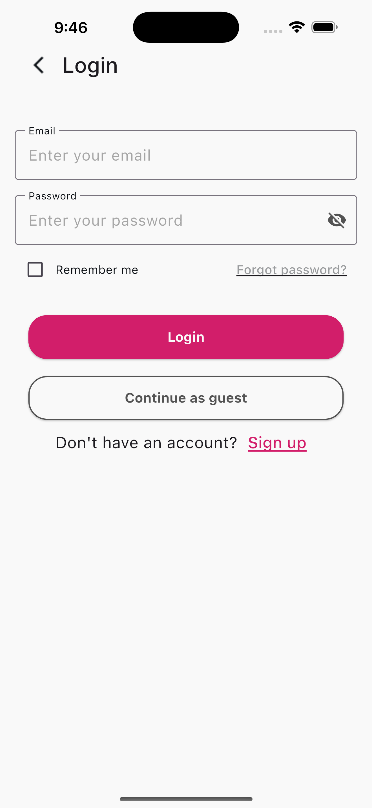
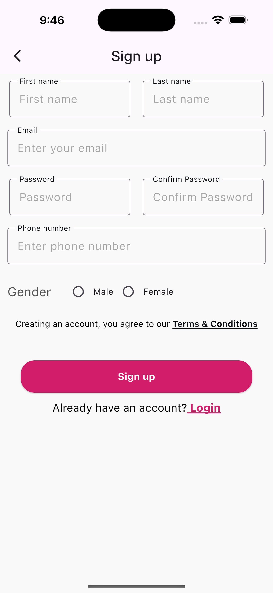
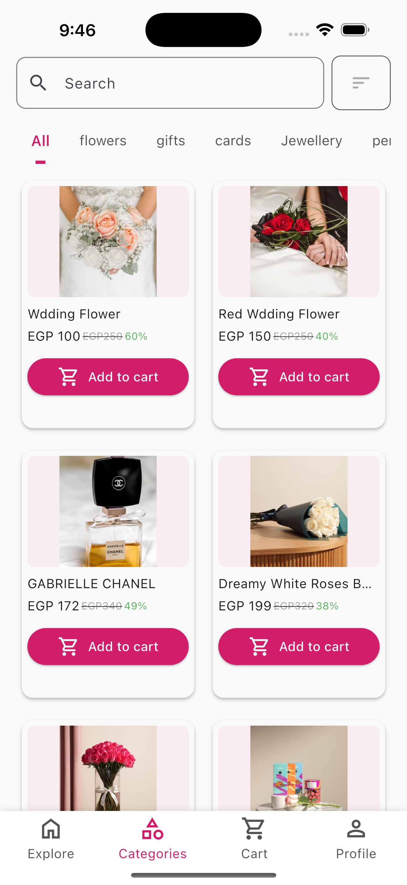
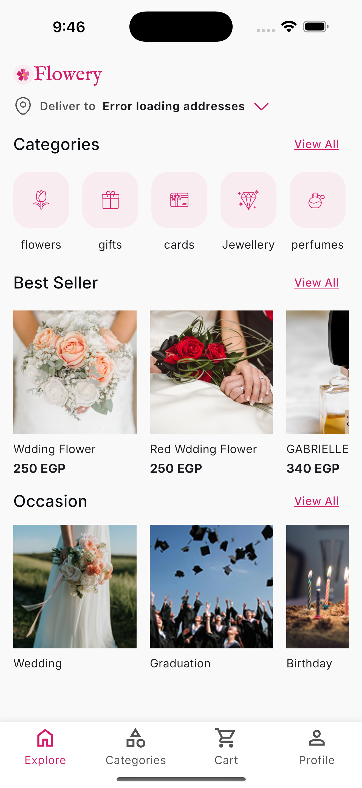
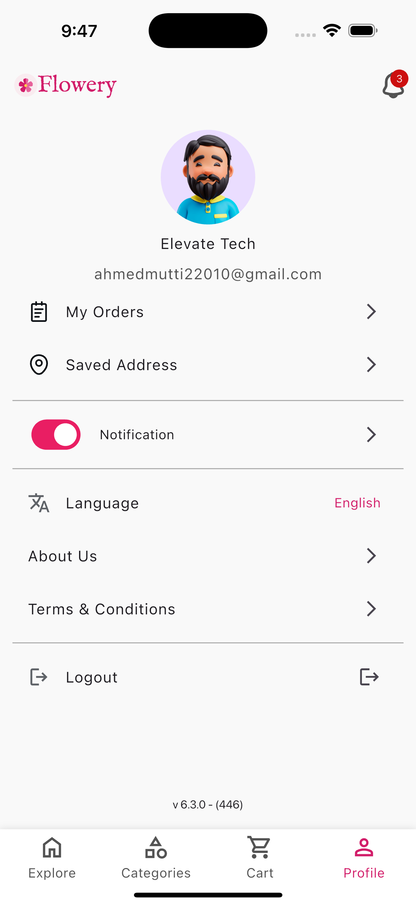
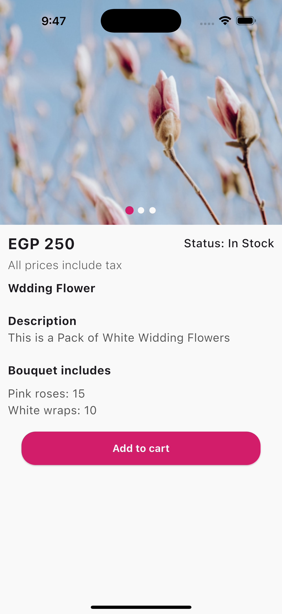

# 🌸 Flowery - Flower Delivery App

A comprehensive Flutter application for flower delivery services with modern UI/UX and clean architecture implementation.

## Screenshots

### Authentication Features
| Login Screen                           | Signup Screen                            |
|----------------------------------------|------------------------------------------|
|  |  |

### Main Application Tabs
| Categories Tab                                   | Home Tab                             | Profile Tab                                |
|--------------------------------------------------|--------------------------------------|--------------------------------------------|
|  |  |  |

### Product Details
| Product Details Screen |
|------------------------|
|  |

## Project Structure

This Flutter app follows **Clean Architecture** principles with the following structure:

```
lib/
├── core/                           # Core functionality and shared components
│   ├── config/                     # Dependency injection and configuration
│   ├── constants/                  # App constants and themes
│   ├── errors/                     # Error handling
│   ├── extensions/                 # Dart extensions
│   ├── l10n/                       # Localization
│   ├── routes/                     # Navigation routes
│   └── widgets/                    # Reusable widgets
├── features/                       # Feature modules
│   ├── auth/                       # Authentication module
│   ├── address/                    # Address management
│   ├── cart/                       # Shopping cart
│   ├── categories/                 # Product categories
│   ├── checkout/                   # Order checkout
│   ├── dashboard/                  # Main dashboard
│   ├── home/                       # Home screen
│   ├── most_selling_products/      # Product listings
│   ├── notifications/              # Push notifications
│   ├── occasion/                   # Special occasions
│   ├── order/                      # Order management
│   └── profile/                    # User profile
└── main.dart                       # App entry point
```

## Features

### 🔐 Authentication
- **Login/Logout**: Secure user authentication
- **Registration**: New user signup with validation
- **Password Recovery**: Forgot password functionality
- **Guest Mode**: Browse without account

### 🏠 Home & Navigation
- **Dashboard**: Main navigation hub
- **Bottom Navigation**: Easy tab switching
- **Location Services**: GPS-based address detection
- **Search & Filter**: Advanced product search

### 🛍️ Shopping Experience
- **Product Catalog**: Browse flowers by categories
- **Product Details**: Detailed product information
- **Shopping Cart**: Add/remove items
- **Checkout Process**: Secure payment flow
- **Order Tracking**: Real-time order status

### 📍 Address Management
- **Add Address**: Save multiple delivery addresses
- **Map Integration**: Interactive map selection
- **Address Validation**: Ensure accurate delivery

### 👤 User Profile
- **Profile Management**: Update personal information
- **Order History**: View past orders
- **Settings**: App preferences and configuration
- **About Us**: App information and terms

### 🌍 Internationalization
- **Multi-language Support**: English and Arabic
- **RTL Support**: Right-to-left text direction
- **Localized Content**: Region-specific content

## 🛠️ Technical Stack

- **Framework**: Flutter 3.2.1+
- **State Management**: Flutter Bloc/Cubit
- **Architecture**: Clean Architecture
- **Dependency Injection**: GetIt + Injectable
- **Networking**: Dio + Retrofit
- **Local Storage**: Hive + SharedPreferences
- **Maps**: Flutter Map + Geolocator
- **Testing**: Unit tests with Mockito
- **Code Generation**: Build Runner

## 🧪 Testing

The app includes comprehensive test coverage:
- **Unit Tests**: 68+ test files
- **Test Coverage**: ~85-90%
- **Mocking**: Mockito for isolated testing
- **Test Structure**: Clean Architecture pattern

## 🚀 Getting Started

### Prerequisites
- Flutter SDK 3.2.1 or higher
- Dart SDK
- Android Studio / VS Code
- Git

### Installation

1. **Clone the repository**
   ```bash
   git clone <repository-url>
   cd flower_app
   ```

2. **Install dependencies**
   ```bash
   flutter pub get
   ```

3. **Generate code**
   ```bash
   flutter packages pub run build_runner build
   ```

4. **Run the app**
   ```bash
   flutter run
   ```

### Running Tests
```bash
# Run all tests
flutter test

# Run tests with coverage
flutter test --coverage
```

## 📦 Dependencies

### Core Dependencies
- `flutter_bloc` - State management
- `dio` - HTTP client
- `retrofit` - API client generation
- `injectable` - Dependency injection
- `get_it` - Service locator

### UI/UX
- `google_fonts` - Typography
- `cached_network_image` - Image caching
- `shimmer` - Loading animations
- `smooth_page_indicator` - Page indicators

### Storage & Data
- `hive` - Local database
- `shared_preferences` - Key-value storage
- `flutter_secure_storage` - Secure storage

### Maps & Location
- `geolocator` - Location services
- `flutter_map` - Interactive maps
- `permission_handler` - Runtime permissions
